# ATM Application
Rudimentary banking application created using socket programming in Python.

Code Files: client.py, server.py

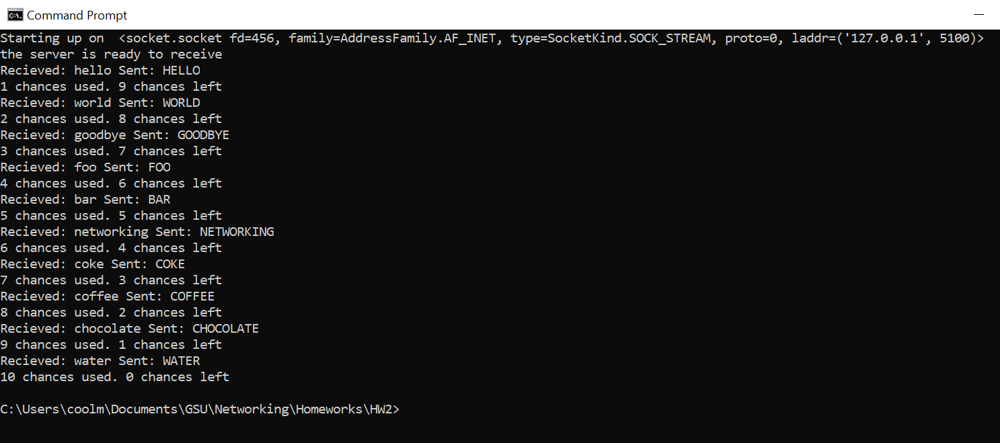

Figure 1 Server side implementation of TCP server. The application shows
the recieved string in lower case and the respective upper case string
sent back to client. The user is limited to 10 tries on the server side
as well as client side.

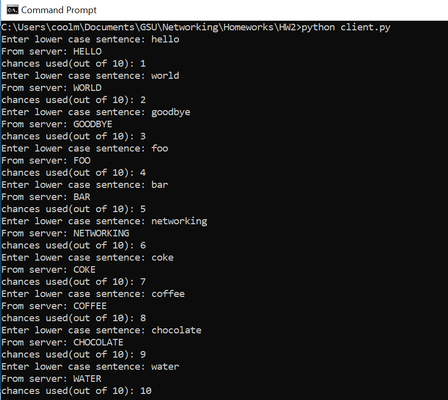

Figure 2: The client application sending the server a string in lower
canse and recieving the value converted to upper case. The user is
limited to 10 tries.

## Multi-threading ##

Files: client\_mt.py, server\_mt.py

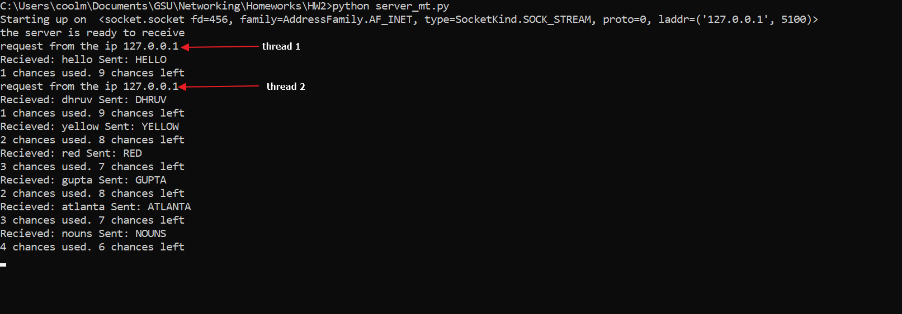

Figure 3: Multi threading has been applied so that multiple clients can
connect to the same server application. The image shows 2 different
client threads being responded to by the server.

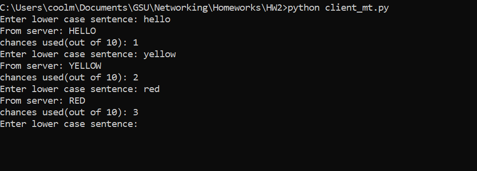

Figure 4: Client 1 being used to connect to server

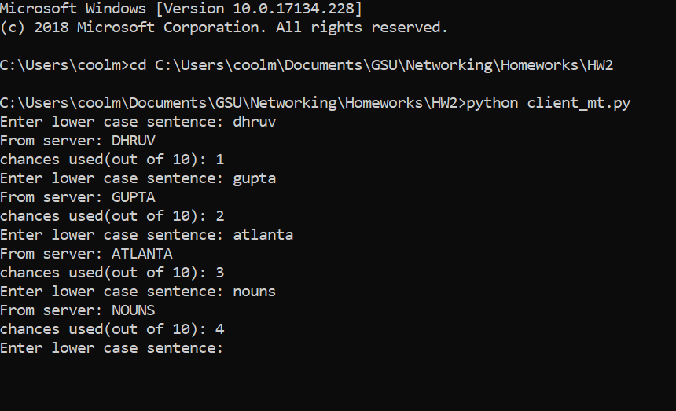

Figure 5: Client 2 connecting to server

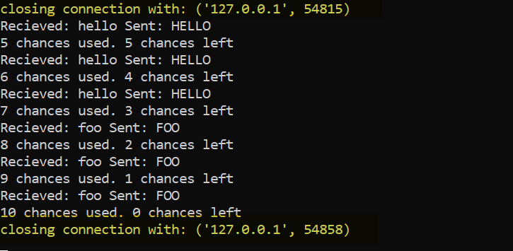

Figure 6: Server side shows closing connections with each user, uniquely
identified by the port. Multi-threading shifts the communication from
the specified port to another port automatically for each client
connection.

## Client-server program to work like an ATM machine using UDP protocol.

Files: udp\_server.py, udp\_client.py, users.csv

Functionality:

-   Verify password

-   Bank transactions: current balance, deposit, withdraw

-   Use 1 file for user info: username -- password -- amount

-   Transaction confirmation

-   Test results

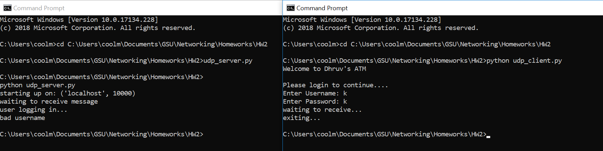

Figure 7: Verification of password. using the wrong credentials fails
the login.

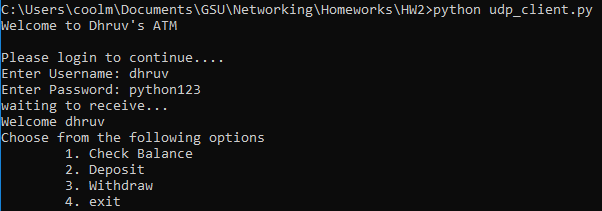

Figure 8: User is provided multiple options on logging in.

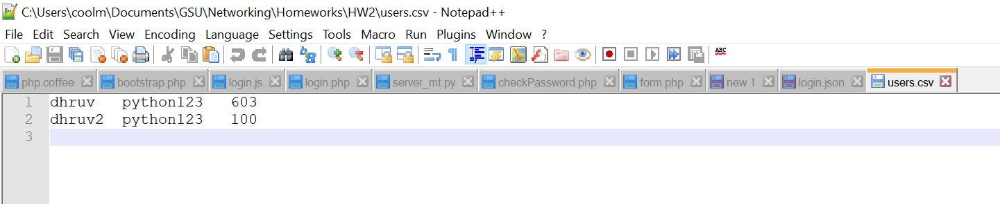

Figure 9: tab spaced file to keep track of username, password and
current account balance

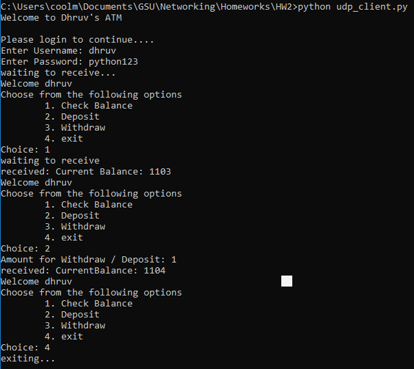

Figure 10: Testing of banking features

[Question 3:]{.underline}

Collect some samples of HTTP status codes from the browser:

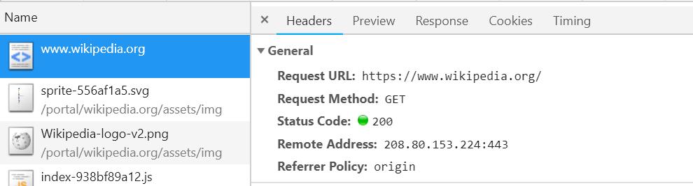

Figure 11: status code 200 implies everything loaded fine.

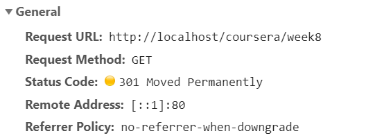{width="3.5833333333333335in"
height="1.3505369641294838in"}

Figure 12: status 301 is used for re-direct, the web page has been moved
and the browser has is given address of the new page to go to

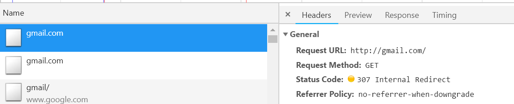

Figure 13: status code 307 imples that the page has been temporarily
been moved.

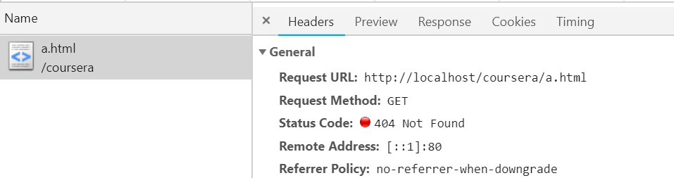

Figure 14: 404 error implies that the page does not exist.

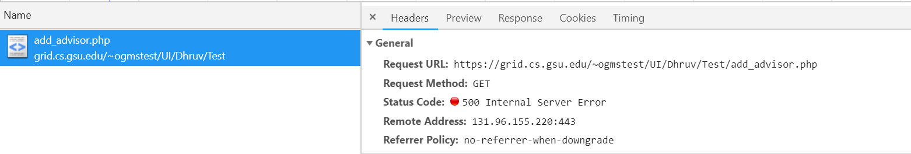

Figure 15: 5\*\* errors are server errors
